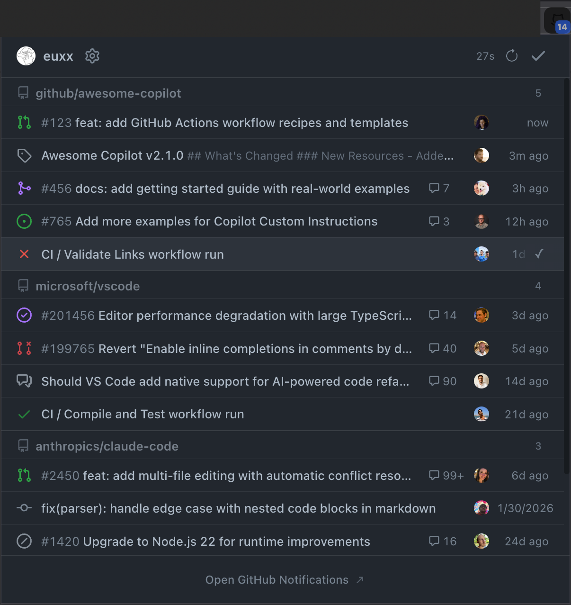
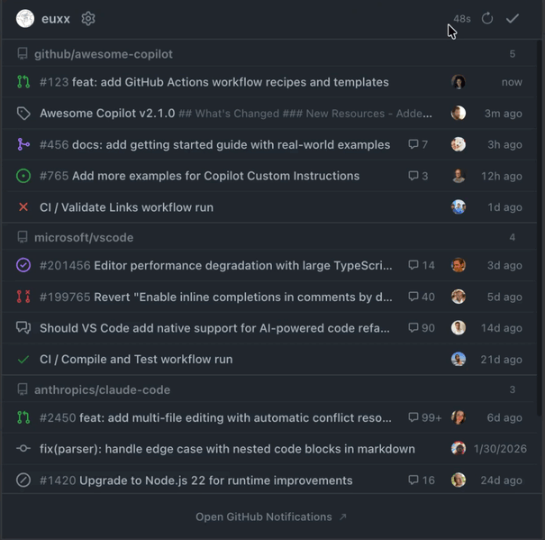
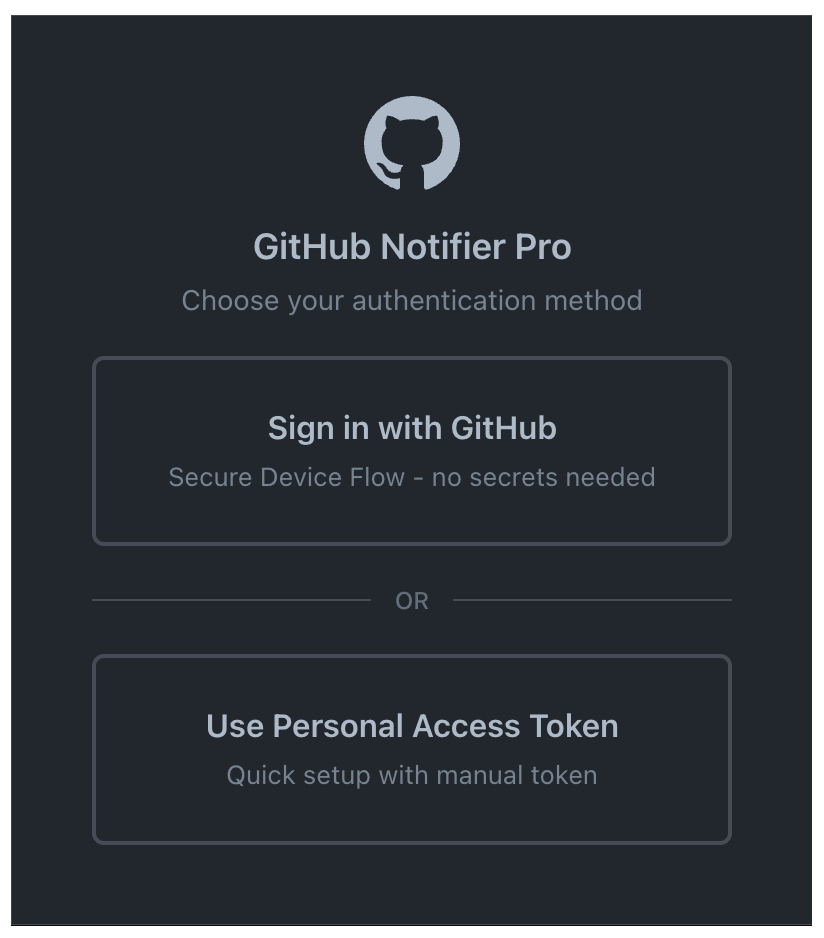
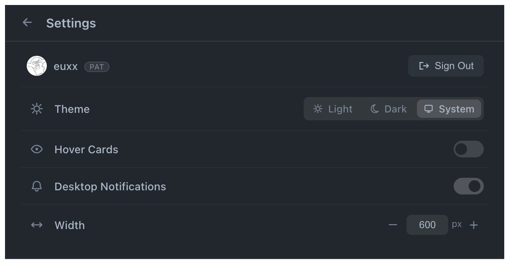

# GitHub Notifier Pro

  
GitHub notifications in the browser toolbar.

  
 <strong>Firefox</strong> — install from <a href="https://addons.mozilla.org/en-GB/firefox/addon/github-notifier-pro/">Mozilla Add-ons</a>.

  
 <strong>Chrome</strong> — <a href="https://github.com/euxx/github-notifier-pro/releases/latest">download .zip</a>, load as unpacked in <code>chrome://extensions/</code>.

## Features

- 🔔 Real-time unread count badge and desktop notifications
- 📋 Issues, PRs, Releases, and all types with rich details
- ✅ Mark as read per notification, per repository, or all at once
- 🔐 OAuth Device Flow or Personal Access Token authentication
- ✨ Clean, minimal UI — feature-rich without the clutter
- 🎨 Light / Dark / System theme with adjustable popup width

<!-- prettier-ignore -->
| | |
|---|---|
|  |  |
|  |  |

## Usage

1. **OAuth (recommended)** — Click "Sign in with GitHub", enter the code on GitHub
2. **Personal Access Token** — Generate a token with `repo` and `notifications` scopes at [GitHub Settings](https://github.com/settings/tokens)

## Development

See [DEVELOPMENT.md](DEVELOPMENT.md) for installation, building, and setup.

## License

Under the [MIT](LICENSE) License.
